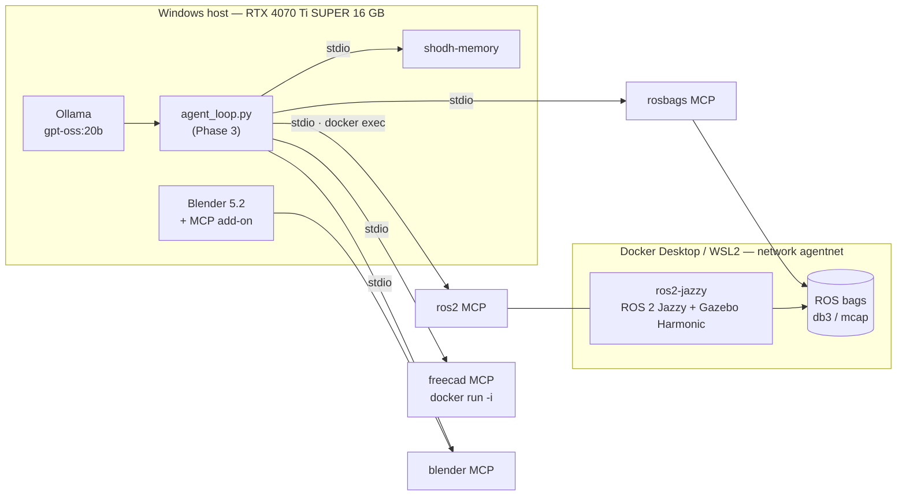

# DroneCAD — Humanoid agentic prototyping stack

[](https://github.com/leosand/DroneCAD/actions/workflows/ci.yml)

> **EN** — Agentic humanoid-robot prototyping stack: Blender + FreeCAD + ROS 2 Jazzy + Gazebo Harmonic + MCP servers, driven by a local agentic coding model on a single RTX 4070 Ti SUPER (16 GB VRAM, Windows host + Docker Desktop/WSL2).
> **FR-CA** — Stack de prototypage humanoïde agentique : Blender + FreeCAD + ROS 2 Jazzy + Gazebo Harmonic + serveurs MCP, pilotée par un modèle de codage agentique local sur une seule RTX 4070 Ti SUPER (16 Go VRAM, hôte Windows + Docker Desktop/WSL2).

- Founding brief (contract, verbatim): [`PROMPT_KIMI_CODE.md`](PROMPT_KIMI_CODE.md)
- Live status, evidence and blockers: [`REPORT.md`](REPORT.md) — **the single source of truth for progress**
- Engineering decisions: [`ARCHITECTURE.md`](ARCHITECTURE.md) (ADR 0001–0006)

---

## English

### Status (2026-09-18)

| Phase | Scope | Status |
|---|---|---|
| 0. Hardware & local model | Probes, dependency audit, model selection, benchmark | ✅ Done — `gpt-oss:20b`, see [`docs/phase-0-hardware.md`](docs/phase-0-hardware.md) |
| 1. Isolation & orchestration | Docker Compose, ROS 2 Jazzy + Gazebo Harmonic, MCP servers | ✅ Multi-stage image (`dronecad/ros2-jazzy:0.1.0`: Gazebo Harmonic 8.15.0, MoveIt 2, `gz_ros2_control`; vendored `ros2_mcp`), non-root containers (uid 1000), 3 s stack startup; FreeCAD `robust-mcp` bridge installed host-side |
| 2. Humanoid design chain | `humanoid_description` / `humanoid_gazebo` / `humanoid_control` ROS 2 packages | ✅ 28-DoF humanoid: **stands ≥ 10 simulated seconds** (z = 1.065 m, roll/pitch ≈ 0), squat tracking 0.031 rad, 11/11 URDF tests (incl. `check_urdf`), colcon green |
| 3. Agentic MCP loop | `agent_loop.py` (design → model → simulate → analyze → iterate) | 🟡 Guards + stdio client + 7 tests ✅; **5/5 MCP servers verified** — `tools/list`: blender 31, freecad 83, ros2 20, rosbags 15, memory 38, with **live tool calls** (Blender scene read, FreeCAD 1.1.3); end-to-end loop run pending |
| 4. CI/CD & quality | colcon build, Gazebo headless tests, Trivy scans, multi-stage image | 🟡 Minimal CI green (compose/JSON/YAML + stack validation) |
| 5. Verification | 7-item end-to-end checklist | 🟡 Tracked item-by-item in [`REPORT.md`](REPORT.md) |

### Architecture



### Hardware & local model (Phase 0, measured)

| Item | Measured |
|---|---|
| GPU | NVIDIA RTX 4070 Ti SUPER — 16 376 MiB VRAM, driver 610.88 |
| System | Intel Xeon W-2123 (4c/8t) · 31.7 GB RAM · Windows · Docker 29.7.2 (WSL2) |
| Model | **`gpt-oss:20b`** — 14 GB (MXFP4), 128K ctx, tools — **115.4 tok/s, 100 % GPU at ctx 8192**, served by a dedicated Ollama instance (`:11499`, ADR-0007) — see [`docs/phase-0-hardware.md`](docs/phase-0-hardware.md) |
| Rejected | `devstral:22b` (does not exist) · `devstral-small-2:24b` (15 GB, no KV margin) · `qwen3-coder-next` (52 GB, not ~16 GB) — ADR-0002 |

### Quick start

```bash
git clone https://github.com/leosand/DroneCAD.git && cd DroneCAD
docker compose config -q            # validate compose
python scripts/validate_stack.py    # loopback-only ports, no privileged, no secrets, MCP registry
```

**MCP registration note** — `.mcp.json` is the canonical registry for stdio MCP clients (Claude Code / Cursor read it as-is); the `rosbags` entry uses `${DRONECAD_HOME}` (set it to this repository's absolute path). Kimi Code does not read `.mcp.json` natively today — per-client registration is a Phase 3 item (see `REPORT.md`).

### Repository layout

```
DroneCAD/
├── PROMPT_KIMI_CODE.md      # founding brief (verbatim)
├── README.md                # this file (EN / FR-CA)
├── ARCHITECTURE.md          # ADR 0001–0006
├── REPORT.md                # live status + verification checklist
├── CHANGELOG.md             # Keep a Changelog · releases full-auto via parent harness
├── AGENTS.md                # instructions for AI agents working here
├── .mcp.json                # MCP server registry (localhost only)
├── docker-compose.yml       # runtime services (security baseline)
├── .github/workflows/ci.yml # scaffold validation (SHA-pinned actions)
├── docs/phase-0-hardware.md # probe logs + model decision matrix
├── scripts/validate_stack.py
└── ws/                      # colcon workspace (Phase 2 packages)
```

### Reference repositories audited (2026-09-18)

| Repository (owner/repo) | Verdict | License | Last activity | Notes |
|---|---|---|---|---|
| `wise-vision/ros2_mcp` | **adopt** | MPL-2.0 | 2026-08-19 | ROS 2 MCP over stdio; CI tests; rich toolset |
| `kakimochi/ros2-mcp-server` | inspiration | none detected | 2025-06 | Stale, `/cmd_vel` only, Humble — not used |
| `spkane/freecad-addon-robust-mcp-server` + `ghcr.io/spkane/freecad-robust-mcp` | **adopt** | MIT | 2026-09-15 | Image runs as stdio MCP (`docker run -i`); ⚠️ the repo `spkane/freecad-robust-mcp` itself does not exist |
| `neka-nat/freecad-mcp` | adopt (upstream) | MIT | 2026-09-17 | `uvx freecad-mcp`; design upstream of spkane |
| `binabik-ai/mcp-rosbags` | fork if needed | Apache-2.0 | 2025-09-21 | 1 year stale, no CI; fork to keep it maintained |
| `ahujasid/mcp-for-blender` (ex `blender-mcp`) | adopt (provisional) | MIT | 2026-09-16 | `uvx mcp-for-blender`; Blender 5.x compatibility unverified |
| Blender Lab official MCP (`projects.blender.org/lab/blender_mcp`) | adopt/compare | GPL-3.0-or-later | v1.0.3 — 2026-09-11 | Requires Blender ≥ 5.1 (host: 5.2 ✅); client-side CLI to confirm (Phase 3) |
| `dfki-ric/phobos` | ⚠️ avoid for Blender ≥ 4.2 | BSD-3-Clause | tag 2.0.2 (2025-05) | Tested on Blender 3.3 LTS; 4.2 breakage in open issues → Phase 2 export plan revised (ADR-0004) |
| `varun29ankuS/shodh-memory` | **adopt** | Apache-2.0 | 2026-09-14 | `npx -y @shodh/memory-mcp`; REST :3030; ships a ROS 2 transport |
| `gazebosim/ros_gz` | adopt | Apache-2.0 | 2026-09-15 | Canonical ROS↔Gazebo bridge (⚠️ `ros2/ros_gz` does not exist) |
| `gazebosim/gz-sim` (Harmonic = `gz-sim8` LTS) | adopt | Apache-2.0 | LTS, EOL 2029 | Simulation core |
| `ros-controls/ros2_control` 6.10.1 · `moveit/moveit2` 2.15.2 | adopt | Apache-2.0 / BSD-3 | 2026-09-16/18 | Control + planning stacks |

### Security posture

- Containers: non-root users, **no** `privileged: true`, no host networking; published ports bound to `127.0.0.1` only.
- Repo: GitHub secret scanning + push protection enabled at creation; CI-pinned actions by SHA; `scripts/validate_stack.py` gates ports/secrets/privileged in CI.
- No secrets in repo — `.env*`, keys and credentials are git-ignored and refused by convention.

---

## Français (FR-CA)

### État (2026-09-18)

| Phase | Portée | État |
|---|---|---|
| 0. Matériel & modèle local | Sondes, audit des dépendances, choix du modèle, banc d'essai | ✅ Terminé — `gpt-oss:20b`, voir [`docs/phase-0-hardware.md`](docs/phase-0-hardware.md) |
| 1. Isolation & orchestration | Docker Compose, ROS 2 Jazzy + Gazebo Harmonic, serveurs MCP | ✅ Image multi-étapes (`dronecad/ros2-jazzy:0.1.0` : Gazebo Harmonic 8.15.0, MoveIt 2, `gz_ros2_control` ; `ros2_mcp` vendoré), conteneurs non-root (uid 1000), démarrage de pile 3 s ; pont FreeCAD `robust-mcp` installé côté hôte |
| 2. Chaîne de conception humanoïde | Paquets ROS 2 `humanoid_description` / `humanoid_gazebo` / `humanoid_control` | ✅ Humanoïde 28 DoF : **debout ≥ 10 s simulées** (z = 1,065 m, roll/pitch ≈ 0), squat suivi 0,031 rad, 11/11 tests URDF (dont `check_urdf`), colcon vert |
| 3. Boucle agentique MCP | `agent_loop.py` (concevoir → modéliser → simuler → analyser → itérer) | 🟡 Garde-fous + client stdio + 7 tests ✅ ; **5/5 serveurs MCP vérifiés** — `tools/list` : blender 31, freecad 83, ros2 20, rosbags 15, memory 38, avec **appels d'outils réels** (scène Blender lue, FreeCAD 1.1.3) ; boucle bout-en-bout à exécuter |
| 4. CI/CD & qualité | build colcon, tests Gazebo sans interface, scan Trivy, image multi-étapes | 🟡 CI minimale verte (compose/JSON/YAML + validation de pile) |
| 5. Vérification | Liste de contrôle de bout en bout (7 points) | 🟡 Suivie point par point dans [`REPORT.md`](REPORT.md) |

### Matériel & modèle local (Phase 0, mesuré)

| Élément | Valeur mesurée |
|---|---|
| GPU | NVIDIA RTX 4070 Ti SUPER — 16 376 Mio de VRAM, pilote 610.88 |
| Système | Intel Xeon W-2123 (4 cœurs/8 fils) · 31,7 Go de RAM · Windows · Docker 29.7.2 (WSL2) |
| Modèle | **`gpt-oss:20b`** — 14 Go (MXFP4), contexte 128 K, outils — **115,4 tok/s, 100 % GPU à ctx 8192**, servi par une instance Ollama dédiée (`:11499`, ADR-0007) — détails dans [`docs/phase-0-hardware.md`](docs/phase-0-hardware.md) |
| Rejetés | `devstral:22b` (n'existe pas) · `devstral-small-2:24b` (15 Go, marge KV insuffisante) · `qwen3-coder-next` (52 Go, pas ~16 Go) — ADR-0002 |

### Démarrage rapide

```bash
git clone https://github.com/leosand/DroneCAD.git && cd DroneCAD
docker compose config -q            # valider le compose
python scripts/validate_stack.py    # ports en boucle locale, pas de privileged, pas de secrets, registre MCP
```

**Note d'enregistrement MCP** — `.mcp.json` est le registre canonique des clients MCP en stdio (Claude Code / Cursor le lisent tel quel) ; l'entrée `rosbags` utilise `${DRONECAD_HOME}` (définir cette variable avec le chemin absolu du dépôt). Kimi Code ne lit pas `.mcp.json` nativement aujourd'hui — l'enregistrement par client est prévu en Phase 3 (voir `REPORT.md`).

### Arborescence

Voir la section anglaise ci-dessus — mêmes chemins, commentaires en français dans chaque fichier.

### Dépôts de référence audités

Voir le tableau de la section anglaise (audit du 2026-09-18, verdicts adopt/fork/inspiration/avoid).

### Posture de sécurité

- Conteneurs : utilisateurs non-root, **aucun** `privileged: true`, pas de mise en réseau de l'hôte ; les ports publiés sont liés à `127.0.0.1` uniquement.
- Dépôt : analyse de secrets GitHub + protection contre l'envoi activées à la création ; actions CI épinglées par empreinte SHA ; `scripts/validate_stack.py` verrouille ports/secrets/privileged en CI.
- Aucun secret dans le dépôt — les `.env*`, clés et identifiants sont exclus par `.gitignore` et par convention.

### Remarque importante (écarts au brief fondateur)

Le brief suppose un hôte Linux (`free -h`) ; la machine cible réelle est **Windows** : les sondes équivalentes sont exécutées via PowerShell, ROS 2/Gazebo vivent dans des conteneurs Linux (WSL2), Blender et FreeCAD restent sur l'hôte (GUI + GPU). Chaque écart est tracé dans [`REPORT.md`](REPORT.md) et justifié par un ADR.
