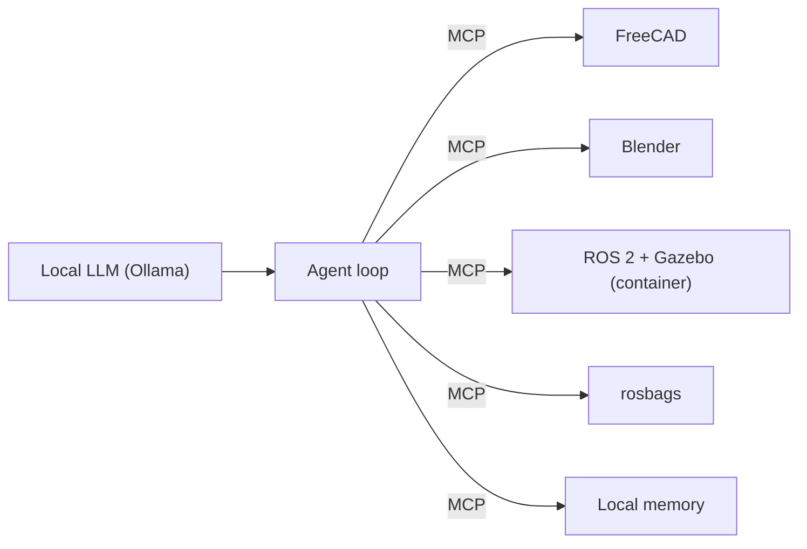

# DroneCAD

[](https://github.com/leosand/DroneCAD/actions/workflows/ci.yml)
[](LICENSE)

Local-first agentic prototyping stack for humanoid robotics. A local LLM (`gpt-oss:20b` served by Ollama) drives **FreeCAD**, **Blender**, **ROS 2 Jazzy** and **Gazebo Harmonic** through **MCP** (Model Context Protocol) servers. Nothing has to leave your machine.

> **Status: v0.3.0.** Research prototype, validated in simulation only. Review every LLM output before fabricating anything or running it on real hardware.

## What it does

An agent can run this loop end to end (automated test `E2E_OK`):

1. Design a part in FreeCAD and export STEP and STL.
2. Import it into Blender and export BLEND and GLB.
3. Simulate a 28-DoF humanoid in headless Gazebo and record a ROS 2 bag.
4. Analyze the bag (falls, joint effort) and iterate if needed.

Last measured run: 11,526 messages recorded, the robot stood for 10 simulated seconds (base height about 1.06 m), and the peak joint effort stayed within limits.



## Quick start

Prerequisites: Docker with Compose, [Ollama](https://ollama.com) with `gpt-oss:20b` (about 14 GB, 16 GB of VRAM or unified memory recommended), FreeCAD 1.1.x and Blender with the DroneCAD add-on if you want the CAD servers. About 6.3 GB of disk for the container image.

```bash
git clone --recurse-submodules https://github.com/leosand/DroneCAD.git
cd DroneCAD
cp .env.example .env                      # then edit it, see comments inside
python -c "import secrets; print(secrets.token_hex(24))"   # put the result in SHODH_API_KEYS
docker compose config -q                  # validate the compose file
python scripts/validate_stack.py          # security checks: loopback ports, no privileged, no secrets
docker compose up -d                      # ROS 2 + Gazebo + MoveIt 2 container and local memory
```

Next: [docs/USAGE.md](docs/USAGE.md) to connect an MCP client, run the simulation and the agent loop.

## MCP servers

| Server | Purpose | Tools |
|---|---|---|
| `freecad` | Parametric CAD | 83 |
| `blender` | Meshes and scenes | 31 |
| `ros2` | ROS 2 topics, services, actions | 20 |
| `rosbags` | Read and analyze bags | 15 |
| `memory` | Persistent local memory | 38 |

All five are declared in `.mcp.json` and were checked with real `tools/list` and tool calls. Details: [docs/mcp-tools-verified.md](docs/mcp-tools-verified.md).

## Repository layout

| Path | Role |
|---|---|
| `agent/` | Agent loop with guardrails, stdio MCP client, `mcp_call.py` helper |
| `ws/` | ROS 2 workspace: humanoid description, Gazebo and control packages |
| `docker/` | Multi-stage ROS 2 Jazzy image |
| `scripts/` | Validation and helper scripts |
| `vendor/` | Pinned third-party MCP server (git submodule) |
| `docs/` | Usage, testing, verified tools, architecture notes |
| `.mcp.json` | MCP server registry (localhost only) |
| `AGENTS.md` | Instructions for AI coding agents |

## Safety and security

- Containers run as non-root, never privileged, without host networking. Published ports bind to `127.0.0.1` only.
- No secret is committed. `.env` is git-ignored; the memory key is one you generate for your own local server.
- The agent loop uses a per-phase tool allowlist, a per-call timeout and a JSONL journal with correlation IDs.
- CI pins GitHub Actions by SHA and scans the image with Trivy (HIGH and CRITICAL).

Report vulnerabilities privately, see [SECURITY.md](SECURITY.md).

## Documentation

- [Usage guide](docs/USAGE.md)
- [Architecture overview](docs/OVERVIEW.md)
- [Testing guide](docs/TESTING.md)
- [Verified MCP tools](docs/mcp-tools-verified.md)
- [Full documentation index](docs/README.md)
- [Changelog](CHANGELOG.md)

## Contributing

Contributions are welcome. Read [CONTRIBUTING.md](CONTRIBUTING.md) and the [Code of Conduct](CODE_OF_CONDUCT.md).

## License

[MIT](LICENSE). Third-party components under `vendor/` keep their own licenses.
